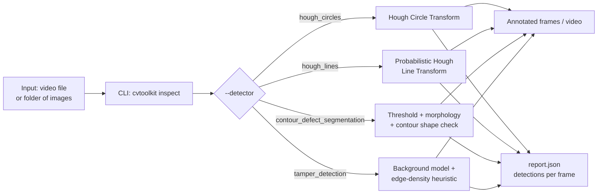

# Classical CV Inspection Toolkit

A small, dependency-light toolkit of **classical (non-deep-learning) computer
vision** tools built on OpenCV, for visual inspection tasks that do not need,
and often should not use, a neural network. It covers four common jobs:

1. **Round-object detection** — find circular parts (bottles, vials, pills,
   washers, wheels) in a frame, using the Hough Circle Transform.
2. **Alignment / edge detection** — find straight edges (a conveyor rail, a
   fiber, a shelf line, a part edge) and check they are where they should
   be, using the probabilistic Hough Line Transform.
3. **Defect / shape segmentation** — threshold and outline blobs, then flag
   any blob whose size or shape falls outside an expected range as a
   defect.
4. **Camera tamper / occlusion detection** — watch the camera feed itself
   and flag if it has been blocked (something covering the lens) or moved
   (bumped out of position), independent of whatever inspection task is
   running.

The real-world problem this solves: a lot of visual inspection work —
checking that a part is round and the right size, that a rail or belt edge
hasn't drifted, that a batch of items on a line don't have an oddly shaped
reject mixed in, or that the inspection camera itself is still pointed at
the right thing — does not require a trained model, a labeled dataset, or a
GPU. It can be solved with a few lines of deterministic, explainable
geometry and thresholding, running comfortably on a CPU, including small
edge devices. This repo packages that approach as reusable, tested
building blocks plus a CLI to run them over a video or a folder of images.

## Why this matters

These four problems show up constantly in day-to-day industrial and
security-style inspection work:

- **Sorting/QC lines**: are the parts passing the camera actually round,
  and the right size? Is there a visibly deformed/broken one mixed in with
  good ones?
- **Alignment checks**: has a conveyor edge, guide rail, or fiber drifted
  out of position? Is a label or part rotated past a tolerance?
- **Blob/defect screening**: does an item's outline (area, aspect ratio)
  fall outside what a "good" item should look like — a crack, a chip, a
  foreign object, a deformed part?
- **Monitoring the camera itself**: is the camera that is doing all of the
  above actually still working — not blocked, not knocked out of position,
  not staring at a wall? This one is easy to forget, but a camera that
  silently goes blind is arguably a worse failure than a single bad
  detection, because everything downstream keeps reporting "all clear" for
  the wrong reason.

None of this requires labeled training data, a GPU, or accepting a model
whose decisions cannot be explained line-by-line — which matters when
someone eventually asks "why did it flag this?" and the honest answer needs
to be more specific than "the network said so."

## Architecture / flow



## Design decisions

### How the Hough Transform actually works (plain English)

Both the circle detector and the line detector are built on the same core
idea, applied to two different shapes: **voting in parameter space.**

Imagine every edge pixel in an image gets to "vote" for every shape that
could have produced it, in a separate space where each axis is a parameter
of the shape rather than a pixel coordinate.

- **For lines**: a line can be written as `y = m·x + b` (or, more robustly,
  in `rho`/`theta` polar form). A single edge pixel `(x, y)` doesn't tell you
  the line by itself — but it tells you every `(m, b)` combination whose line
  would pass through that pixel. That's a curve in `(m, b)`-space. Every edge
  pixel draws its own curve. Wherever many of those curves cross in
  parameter space, that combination of `(m, b)` was "voted for" by many edge
  pixels lying on the same real line — so that peak in parameter space
  becomes a detected line. `cv2.HoughLinesP` does exactly this (using the
  more numerically stable `rho`/`theta` parameterization), and additionally
  clusters the votes back into actual line *segments* with real endpoints,
  which is why it's called the "probabilistic" variant.

- **For circles**: a circle has three parameters — center `(a, b)` and
  radius `r`. Every edge pixel votes for every `(a, b, r)` triple that would
  put a circle of radius `r` through that pixel. Instead of a curve, each
  edge pixel effectively votes for a *cone* in the 3D `(a, b, r)` parameter
  space (OpenCV's `HOUGH_GRADIENT` method speeds this up by using the edge
  gradient direction to only vote along the likely radius line rather than
  the full cone, then does a two-stage search for centers and then radii).
  Wherever votes pile up, that's a detected circle.

The practical upshot: Hough transforms don't try to "recognize" a circle or
line as a whole; they let local edge evidence accumulate into a global
answer through simple voting. That's why they are deterministic (same input
→ same output, always), don't need any training, and are easy to reason
about — but it's also why they are sensitive to the accumulator/vote
threshold and to noisy edges (see "Limitations" below).

### Classical CV vs. deep learning — a genuine tradeoff, not a sales pitch

| | Classical CV (this repo) | Deep learning |
|---|---|---|
| Training data | None needed | Needs a labeled dataset (often hundreds-to-thousands of examples) |
| Compute | Runs fine on a CPU, including small edge devices | Usually wants a GPU for training, often for real-time inference too |
| Explainability | Fully deterministic and inspectable — every decision traces back to a threshold, a contour measurement, or a vote count you can print | Largely a black box; explaining a single decision is hard and sometimes not fully possible |
| Speed to build | Hours, once the geometry/thresholds are understood | Days-to-weeks: data collection, labeling, training, validation |
| Handling scene variability | Struggles with highly variable lighting, backgrounds, occlusion, viewpoint, or object appearance — parameters tuned for one scene often fail on another | Can generalize across lighting, background, and appearance variation it has seen in training, far better than hand-tuned rules |
| Handling unstructured/ambiguous input | Weak — it has no notion of "this looks like a defect even though I've never described that exact shape rule" | Strong — this is exactly the class of problem deep learning is good at |
| Maintenance | Re-tuning a few numeric parameters when the camera or scene changes | Re-training or fine-tuning when the distribution shifts |
| Best for | Fixed camera, roughly known object geometry/size, controlled lighting, need for auditable/explainable decisions, edge/CPU-only deployment | Highly variable or unstructured scenes, subtle/complex defect types, when labeled data and GPU budget both exist |

Honest summary: if the object geometry and camera setup are reasonably
fixed and the "good" vs. "bad" distinction can be described as a shape/size
rule, classical CV is usually faster to build, cheaper to run, and easier to
trust. If the scene is highly variable, the defect definition is fuzzy or
highly visual ("looks wrong" rather than "is the wrong shape"), or there is
already a labeled dataset and a GPU budget, deep learning will generally
outperform hand-tuned classical rules. In practice, a lot of real systems
end up **hybrid**: classical CV for the parts of the pipeline that are
genuinely geometric and stable (find the object, check its outline, check
the camera is healthy), deep learning for the parts that are genuinely
about visual judgment on variable-looking inputs.

### Why camera tamper/occlusion detection matters operationally

It's tempting to think of a vision pipeline's job as only "look at the
scene and report what's in it." But every one of the detectors in this
repo — and any other vision pipeline — is silently assuming the camera is
actually working: not physically blocked, not knocked out of alignment, not
staring at a blank wall because someone bumped the mount. If that
assumption breaks, the pipeline doesn't necessarily fail loudly; it just
keeps confidently reporting "no defects found" or "no parts detected"
because there is genuinely nothing to see in a blocked or misdirected feed.

That is a much worse failure mode than a single bad detection, because
everything downstream keeps trusting a feed that has gone blind. In
practice this is exactly the kind of thing that ends up as an uptime/SLA
requirement for a monitoring or inspection system: not just "did you detect
the defect," but "do you know, and can you prove, that your camera was
actually looking at the right thing the whole time." The tamper detector in
this repo is a small, self-contained way to answer that second question
without any extra hardware — it watches the feed's own statistics
(background difference, frame variance, edge density) to notice when the
view itself has stopped being trustworthy.

## Setup & run instructions

### Local (virtual environment)

```bash
git clone <this-repo-url>
cd classical-cv-inspection-toolkit

python -m venv .venv
# Windows:
.venv\Scripts\activate
# macOS/Linux:
source .venv/bin/activate

pip install -r requirements.txt
pip install -e .
```

Generate the synthetic demo video (a ~10s, 640x480 clip of circular "parts"
moving along a line, with every 5th item swapped for a malformed blob, and
a brief simulated camera-blackout around the 6-second mark):

```bash
python scripts/generate_demo_video.py --output demo.mp4
```

Run each detector against it:

```bash
python -m cvtoolkit inspect --input demo.mp4 --detector hough_circles --output-dir output/hough_circles
python -m cvtoolkit inspect --input demo.mp4 --detector hough_lines --output-dir output/hough_lines
python -m cvtoolkit inspect --input demo.mp4 --detector contour_defect_segmentation --output-dir output/contours
python -m cvtoolkit inspect --input demo.mp4 --detector tamper_detection --output-dir output/tamper
```

Each run writes:

- `output/<name>/frames/` — annotated PNG frames
- `output/<name>/annotated.mp4` — annotated video (when the input is a video file)
- `output/<name>/report.json` — per-frame detections, as JSON

`--input` also accepts a directory of images (`.png`/`.jpg`/`.jpeg`/`.bmp`/`.tif`)
instead of a video file. `--max-frames N` caps how many frames are processed,
which is handy for a quick smoke test on a long clip.

### Docker

```bash
docker build -t cvtoolkit .
docker run --rm -v "$(pwd):/data" cvtoolkit inspect \
    --input /data/demo.mp4 \
    --detector hough_circles \
    --output-dir /data/output/hough_circles
```

(The container's entrypoint is `python -m cvtoolkit`, so any `cvtoolkit`
CLI arguments can be passed directly after the image name.)

## Project structure

```
classical-cv-inspection-toolkit/
├── src/
│   └── cvtoolkit/
│       ├── __init__.py
│       ├── __main__.py
│       ├── cli.py                          # `python -m cvtoolkit inspect ...`
│       └── detectors/
│           ├── hough_circles.py            # round-object detection
│           ├── hough_lines.py              # alignment / edge detection
│           ├── contour_defect_segmentation.py  # blob/shape defect flagging
│           └── tamper_detection.py          # camera tamper/occlusion detection
├── scripts/
│   └── generate_demo_video.py              # synthetic demo video generator
├── tests/
│   ├── test_hough_circles.py
│   ├── test_hough_lines.py
│   ├── test_contour_defect_segmentation.py
│   └── test_tamper_detection.py
├── .github/workflows/ci.yml                # lint (ruff) + test (pytest) on push/PR
├── Dockerfile
├── requirements.txt
├── pyproject.toml
├── LICENSE
└── README.md
```

## Testing

```bash
pip install -r requirements.txt
pip install -e .
pytest -v
```

All tests use small, synthetically drawn OpenCV shapes (`cv2.circle`,
`cv2.rectangle`, `cv2.line`) or synthetic numpy frames — no external image
files or network access are required. They check real behavior, not just
"does it run":

- `hough_circles` finds a drawn circle at approximately its true center and radius.
- `hough_lines` finds drawn horizontal and diagonal lines at approximately their true angle/position.
- `contour_defect_segmentation` flags an intentionally malformed (wrong aspect ratio) blob as a defect, and does **not** flag a normal, well-shaped blob.
- `tamper_detection` flags a fully black/occluded frame as tamper once a normal background has been established, and does **not** flag consecutive near-identical normal frames (no false positive) — plus a sustained "shifted scene" case for the camera-moved path.

## Limitations & production hardening notes

- **Hough parameters are scene-sensitive.** `dp`, `minDist`, `param1`,
  `param2`, and the radius/length ranges were tuned for the synthetic demo
  video's scale and contrast. A different camera resolution, lens, working
  distance, or lighting level will generally need its own pass of manual
  tuning — this is the single biggest practical downside of classical
  Hough-based detection, and it's worth budgeting real time for it on a new
  deployment rather than assuming the defaults will transfer.
- **Lighting and scale changes hit accuracy hard.** Both the circle and
  line detectors run on an edge map or gradient; strong shadows, glare, or
  a camera zoom/distance change shift the effective edge strength and
  object scale, which can silently move detections outside the tuned
  parameter ranges. In production this usually means locking down (or
  actively compensating for) lighting and camera position, and re-tuning
  whenever either changes.
- **Camera-specific calibration is basically required**, not optional, for
  the round-object and alignment detectors if the goal is anything more
  precise than "roughly where the object is" — e.g. converting pixel
  radius to real-world size needs a proper camera calibration (intrinsics
  and known working distance), which isn't included here.
- **The tamper detector's thresholds also need site-specific tuning.**
  What counts as "a large sustained change" (`moved_diff_ratio`,
  `moved_sustained_frames`) or "a uniform/blocked frame"
  (`blocked_std_threshold`, `blocked_edge_ratio`) depends on how much a
  scene naturally moves (a completely static shelf camera vs. a camera
  overlooking foot traffic) and how noisy the sensor is at night/low light.
- **Hybrid robustness.** For scenes with real variability (inconsistent
  lighting, cluttered backgrounds, subtle or highly variable defect
  appearance), the pattern that tends to work best in practice is
  combining this kind of classical CV with a lightweight ML model — for
  example, using Hough/contour detection to cheaply localize candidate
  regions, then a small classifier only on those regions to make the final
  call. That keeps the deterministic, low-compute geometry doing most of
  the work while still getting deep learning's tolerance for messier,
  harder-to-hand-describe visual variation where it actually earns its
  keep.

## Demo


Demo video is hosted externally — replace the placeholder link above with your hosted video URL.

## License

MIT — see [LICENSE](LICENSE).
